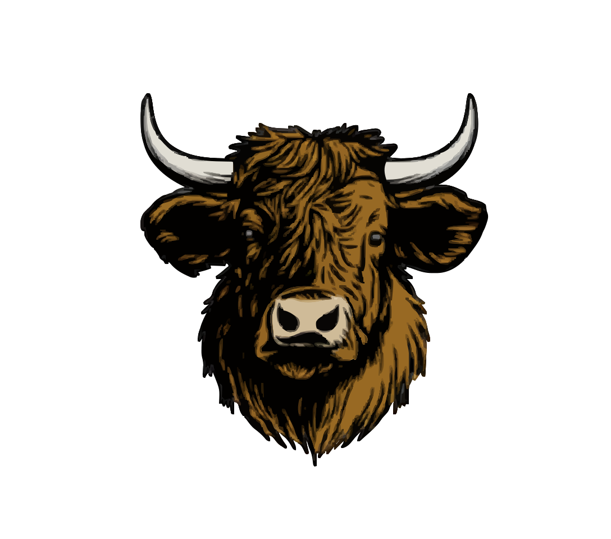

# 🐂 BullCare

<div align="center">



**Gestão inteligente para o sucesso da sua fazenda**

[](https://bullcare.com.br)
[](LICENSE)
[](https://github.com/bullcare)

</div>

---

## 📋 Sobre

A **BullCare** é uma empresa especializada em manejo e gestão de fazendas e animais, oferecendo soluções tecnológicas completas para maximizar a produtividade e o bem-estar do seu rebanho.

Nosso ecossistema de ferramentas transforma dados em decisões estratégicas para o agronegócio moderno.

## 🎯 Nossa Missão

Proporcionar aos produtores rurais as melhores ferramentas e conhecimentos para uma gestão eficiente, sustentável e lucrativa de suas propriedades e rebanhos através da tecnologia.

<!--
## 🚀 Nossos Projetos

### 📱 Aplicações

- **[BullCare App](https://github.com/bullcare/bullcare-app)** - Aplicativo mobile para gestão em campo
- **[BullCare Web](https://github.com/bullcare/bullcare-web)** - Plataforma web completa de gestão
- **[BullCare API](https://github.com/bullcare/bullcare-api)** - API REST para integrações

### 🛠️ Ferramentas

- **[BullCare CLI](https://github.com/bullcare/bullcare-cli)** - Interface de linha de comando
- **[BullCare SDK](https://github.com/bullcare/bullcare-sdk)** - SDK para desenvolvedores
- **[BullCare Docs](https://github.com/bullcare/bullcare-docs)** - Documentação técnica

### 📊 Analytics

- **[BullCare Analytics](https://github.com/bullcare/bullcare-analytics)** - Dashboards e relatórios
- **[BullCare ML](https://github.com/bullcare/bullcare-ml)** - Modelos de machine learning

## 💡 Funcionalidades

### 🐄 Gestão de Rebanho

- Controle individual de animais
- Rastreamento de genealogia
- Gestão reprodutiva e sanitária
- Controle de peso e desenvolvimento
- Histórico médico e vacinal

### 🌾 Gestão de Fazenda

- Planejamento de pastagens
- Controle financeiro e custos
- Gestão de insumos e estoque
- Análise de produtividade
- Monitoramento de áreas

### 🤖 Tecnologia

- Sistema multiplataforma (Web, iOS, Android)
- Relatórios e dashboards em tempo real
- Alertas automáticos e notificações
- Integração com IoT e equipamentos de campo
- API RESTful para integrações

## 🛠️ Stack Tecnológico

```
Frontend:      React.js, React Native, TypeScript
Backend:       Node.js, Python, PostgreSQL
Mobile:        React Native, Expo
Cloud:         AWS, Docker, Kubernetes
Analytics:     Python, TensorFlow, Pandas
IoT:           MQTT, Arduino, ESP32
```

## 📊 Estatísticas

<div align="center">

| Métrica                | Valor    |
| ---------------------- | -------- |
| 🏢 Fazendas Ativas     | 500+     |
| 🐂 Animais Gerenciados | 100.000+ |
| 👥 Usuários Ativos     | 2.000+   |
| 📍 Estados Atendidos   | 15       |

</div>

## 🤝 Como Contribuir

Adoramos contribuições da comunidade! Veja como você pode ajudar:

1. 🍴 Fork o projeto
2. 🔨 Crie sua feature branch (`git checkout -b feature/AmazingFeature`)
3. ✅ Commit suas mudanças (`git commit -m 'Add some AmazingFeature'`)
4. 📤 Push para a branch (`git push origin feature/AmazingFeature`)
5. 🎉 Abra um Pull Request

Leia nosso [Guia de Contribuição](CONTRIBUTING.md) para mais detalhes.

## 📖 Documentação

- [Documentação Completa](https://docs.bullcare.com.br)
- [API Reference](https://api.bullcare.com.br/docs)
- [Guia de Início Rápido](https://docs.bullcare.com.br/quickstart)
- [FAQ](https://docs.bullcare.com.br/faq)

## 🔒 Segurança

A segurança dos dados é nossa prioridade. Se você descobrir alguma vulnerabilidade, por favor envie um email para security@bullcare.com.br.

Veja nossa [Política de Segurança](SECURITY.md) para mais informações. -->

## 📞 Contato

<div align="center">

[](mailto:contato@bullcare.com.br)
[](https://linkedin.com/company/bullcare)
[](https://twitter.com/bullcare)

</div>

---

<div align="center">

**[Website](https://bullcare.com.br)** • **[Documentação](https://docs.bullcare.com.br)** • **[Blog](https://blog.bullcare.com.br)**

Feito com ❤️ pela equipe BullCare

</div>
